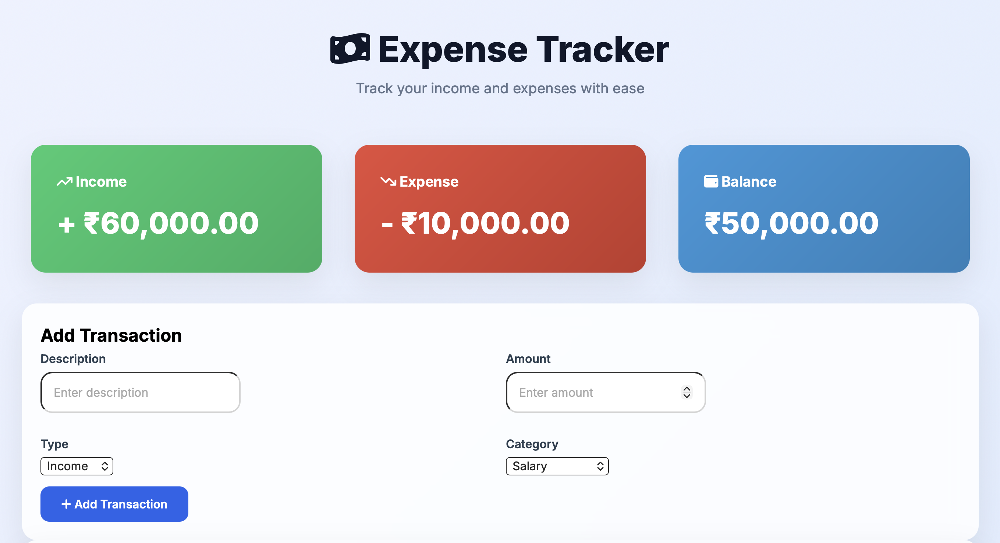
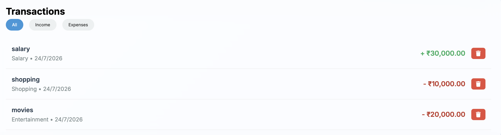
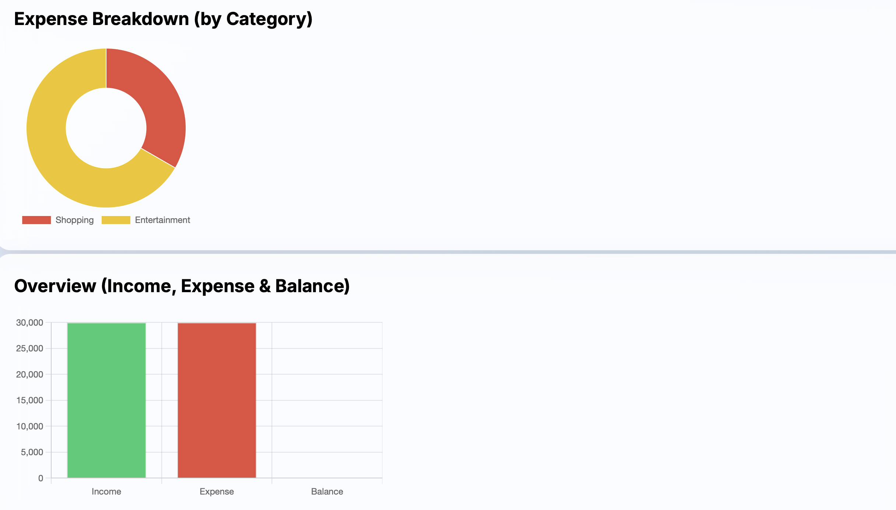

# 💰 Expense Tracker

A simple and responsive Expense Tracker built using HTML, CSS, JavaScript, and Chart.js.

## 🚀 Live Demo

https://shridharsp18.github.io/Expensive-Tracker/

## ✨ Features

- Add income and expenses
- Delete transactions
- Local Storage support
- Interactive charts
- Responsive design

## 🛠 Technologies Used

- HTML5
- CSS3
- JavaScript (ES6)
- Chart.js

## 📸 Screenshots

### Dashboard

### Transactions

### Analytics

## 👨‍💻 Author

Shridhar